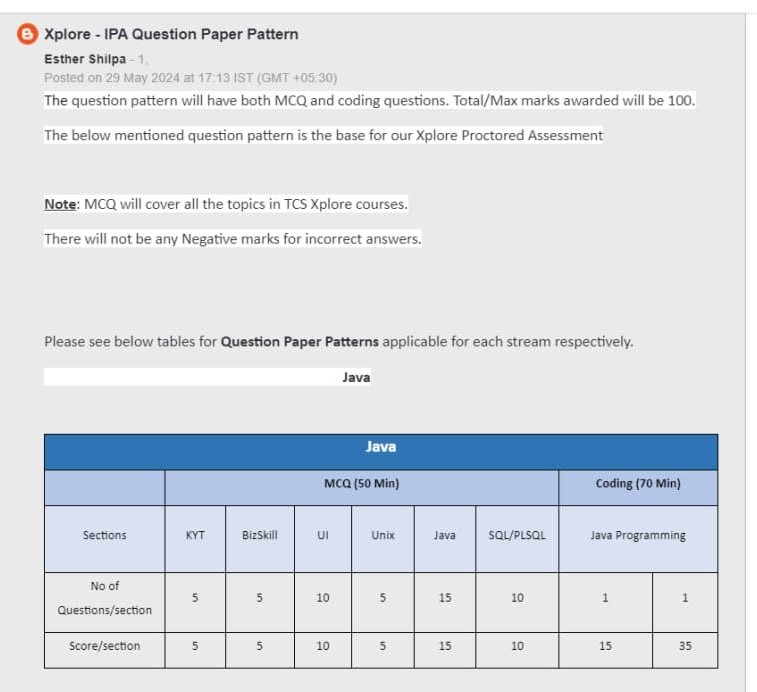

# TCS IPA Exam Preparation Guide
Welcome to the **TCS IPA Exam Preparation** repository! This repository is designed to help students prepare for the **TCS iON Proctored Assessment (IPA)**, a crucial part of the **TCS Xplore Digital Program**. Here, you will find study materials, coding problems, and practice tests to ace your TCS IPA exam.

- Question Start with **basic = 15 marks**
- Questions start with **adv = 35 marks**

## 📌 What is TCS IPA?
The **TCS IPA (iON Proctored Assessment)** is an offline test conducted at TCS iON centers. It is a mandatory assessment for candidates undergoing the **TCS Xplore program**, which aims to train freshers in fundamental and advanced IT skills. Clearing the IPA exam is essential before receiving your **joining letter** from TCS.

## Who are eligible for IPA assessment?
IPA is applicable for candidates who have accepted TCS **offer Letter** (Ninja/Digital/Pega/TCS Atlas).
 
## 📚 Exam Pattern
The TCS IPA exam consists of **MCQ-based questions** and **coding problems**. The total marks for the exam are **100**, and there is **no negative marking**.



### 📝 MCQ Section (50 Minutes)

The MCQ section covers various topics from TCS Xplore courses:

| Sections      | No. of Questions | Score |
|--------------|----------------|------|
| KYT (Know Your Technology) | 5 | 5 |
| BizSkill     | 5 | 5 |
| UI (User Interface) | 10 | 10 |
| Unix        | 10 | 15 |
| Java        | 15 | 15 |
| SQL/PLSQL   | 10 | 10 |

### 💻 Coding Section (70 Minutes)
The coding section consists of **two programming questions**:

| Section          | No. of Questions | Score |
|----------------|----------------|------|
| Java Programming | 1 | 15 |
| Java Programming | 1 | 35 |

## 📖 Syllabus
The syllabus includes the following topics:

- **KYT (Know Your Technology):** Basic IT concepts and industry trends.
- **BizSkill:** Business communication, soft skills, and professional ethics.
- **UI (User Interface):** HTML, CSS, JavaScript, and frontend development basics.
- **Unix:** Unix commands, shell scripting, and operating system concepts.
- **Java:** Core Java, object-oriented programming (OOPs), exception handling, collections, multithreading, and file handling.
- **SQL/PLSQL:** Database concepts, queries, joins, functions, procedures, and triggers.
- **Java Programming:** Problem-solving using Java, data structures, and algorithms.

## 🛠 Resources Provided
This repository includes:
- ✅ **Topic-wise Notes** for all subjects.
- ✅ **MCQ Practice Questions** with solutions.
- ✅ **Previous Year Questions** and mock tests.
- ✅ **Coding Problems** with solutions and explanations.

## 🚀 How to Use This Repository
1. Clone the repository:
   ```sh
   git clone https://github.com/chandankushwahaa/TCS-IPA-PRA-Notes
   cd TCS-IPA-PRA-Notes
   ```
2. Explore the **notes**, **MCQs**, and **coding problems** in their respective folders.
3. Practice coding problems in Java and try to optimize solutions.
4Refer to additional resources and contribute to the repo!

## 🤝 Contributing
Contributions are welcome! If you have additional questions, solutions, or study materials, feel free to **fork this repository** and submit a **pull request**.

## 🎯 Final Tips
- **Time Management:** Practice answering MCQs quickly and efficiently.
- **Coding Proficiency:** Focus on Java programming and data structures.
- **Concept Clarity:** Understand fundamental concepts instead of rote learning.


📚 **Happy Learning & All the Best for Your TCS IPA Exam!** 🎯🚀
